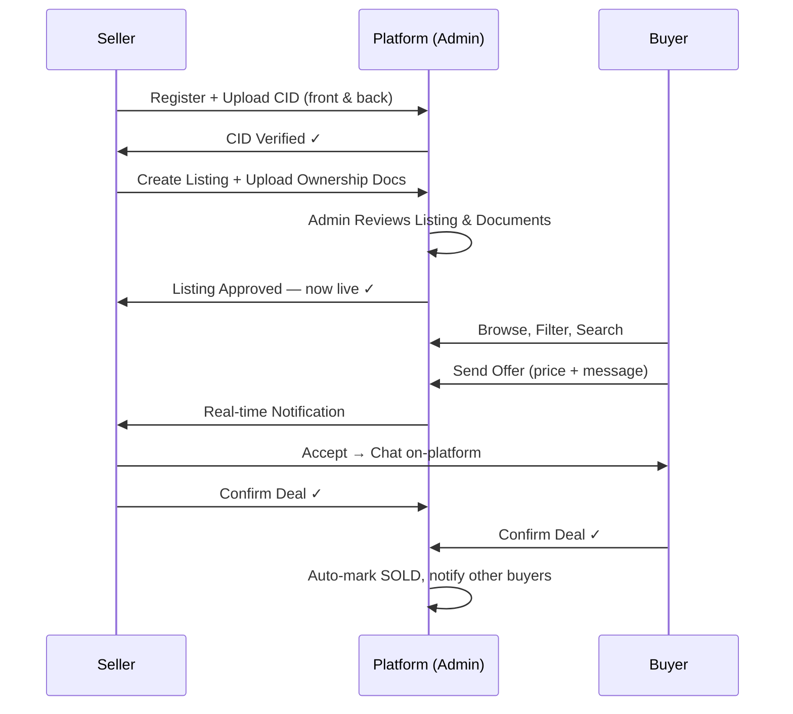
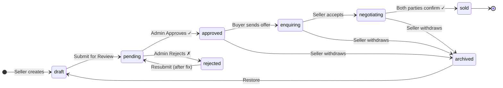
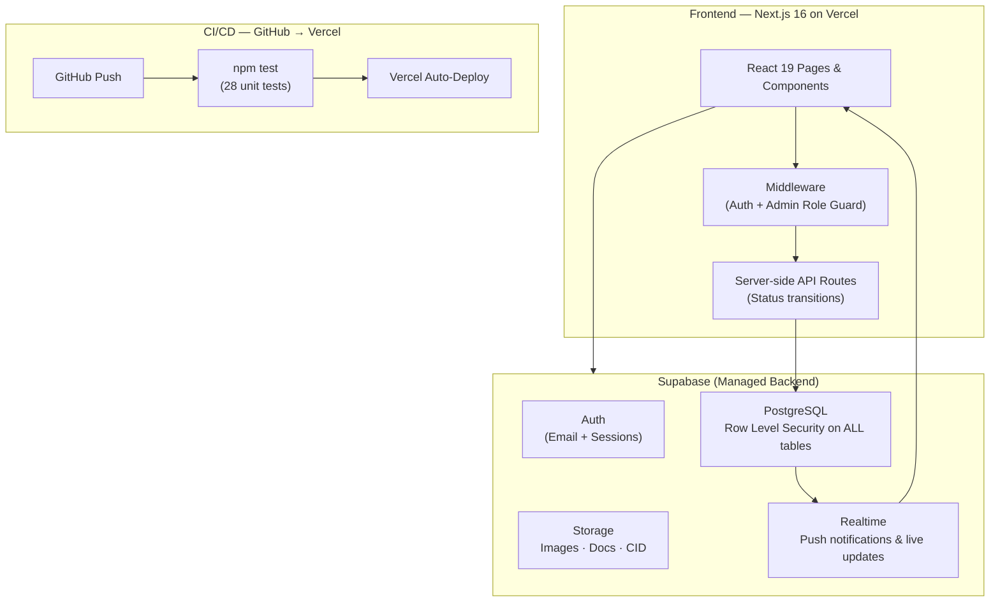
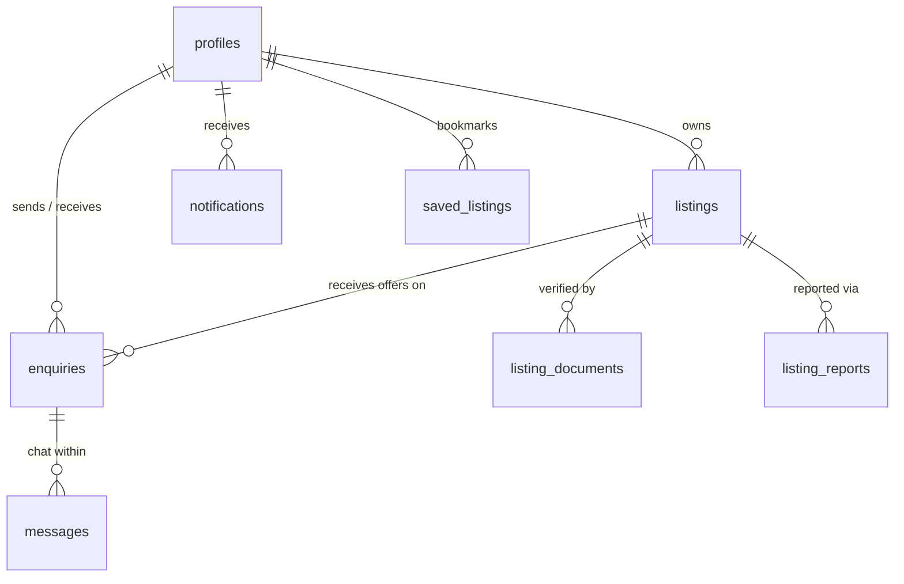
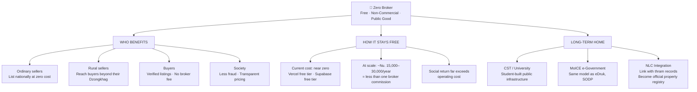

# Zero Broker — IDE303 Final Presentation
### 12-Minute Slide Script with Diagrams

> **Timing guide:** Each slide has an estimated time. Stick to it — 12 min is tight.
> **Demo tip:** Have the browser open at `localhost:3000` (or the live Vercel URL) with an admin account already logged in before you begin.

---

## SLIDE 1 — Title (0:00–0:20)

```
┌─────────────────────────────────────────────────────────┐
│                                                         │
│           🏡  ZERO BROKER                               │
│                                                         │
│     Bhutan's First Verified Real Estate Platform        │
│                                                         │
│     IDE303 · Software Engineering Startup               │
│     College of Science and Technology, Bhutan           │
│                                                         │
└─────────────────────────────────────────────────────────┘
```

**SCRIPT:**
> "Good [morning/afternoon]. We are presenting Zero Broker — Bhutan's first centralised, broker-free property marketplace. In the next 12 minutes we'll show you the problem we are solving, the platform we built, and why this model is sustainable."

---

## SLIDE 2 — The Problem (0:20–1:10)

```
┌─────────────────────────────────────────────────────────┐
│                  THE PROBLEM                            │
│                                                         │
│  🔴  No formal property marketplace in Bhutan           │
│  🔴  Buyers rely on brokers charging 1–3% commission    │
│  🔴  No way to verify a seller's identity               │
│  🔴  Fraud, duplicate listings, inflated prices         │
│  🔴  Rural sellers exploited by middlemen               │
│                                                         │
│  "If you want to buy land in Punakha,                   │
│   you ask your uncle's friend's colleague."             │
└─────────────────────────────────────────────────────────┘
```

**SCRIPT:**
> "In Bhutan today, there is no Zillow, no 99acres, no centralised marketplace for property. If you want to buy or sell land, you use a broker — who charges 1 to 3% of the transaction value. For a property worth Nu. 80 lakh, that is Nu. 80,000 to 2.4 lakh, gone to an intermediary who simply made an introduction. On top of that, there is no way to verify a seller's identity, no document trail, and fraud is common. We built Zero Broker to fix this."

---

## SLIDE 3 — Our Solution (1:10–2:00)

```
┌─────────────────────────────────────────────────────────┐
│                  OUR SOLUTION                           │
│                                                         │
│  ✅  Direct seller-to-buyer marketplace                  │
│  ✅  CID-verified seller identities                      │
│  ✅  Admin-moderated listings (no fraud goes live)       │
│  ✅  Ownership documents verified before listing         │
│  ✅  On-platform deal confirmation — paper trail         │
│  ✅  0% commission charged to either party               │
│                                                         │
│       We removed the broker. Not the safety.            │
└─────────────────────────────────────────────────────────┘
```

**SCRIPT:**
> "Zero Broker removes the broker but replaces everything useful the broker provided. Seller identity is verified through the national CID. Every listing is reviewed by an admin before going live. Ownership documents are uploaded and checked. Both buyer and seller formally confirm the deal on our platform — creating a legal record. And we charge zero commission. The question we were asked in our own review was — isn't sending an enquiry just like sending a WhatsApp? The answer is no. On WhatsApp you don't know if the seller owns the property. On Zero Broker, you do. Let us show you."

---

## SLIDE 4 — LIVE DEMO (2:00–6:00) · 4 minutes

> ⚠️ **This is the most important 4 minutes. Practice this flow 3 times before presenting.**

### Demo Script & Flow:

**[0:00 – 0:30] Homepage**
- Open the site
> "This is our homepage. It shows featured properties, recent listings, and a live counter of active listings and verified sellers across Bhutan."
- Type "Thimphu" in the search bar, press Search
> "Search filters by Dzongkhag, property type, and keyword — in real time."

**[0:30 – 1:00] Listings Page**
- Show filter panel: Dzongkhag, type, price range, bedrooms
- Click "Land / Plot" filter chip
- Show "Load More" pagination
> "Buyers can filter by all 20 Dzongkhags, property type, price range, and bedroom count. Listings are paginated — showing 12 at a time with a load more."

**[1:00 – 1:45] Property Detail Page**
- Click on a property
- Scroll to show: image gallery, specs, documents panel, EMI calculator
> "Each listing shows verified documents, an EMI calculator with BNB and BDBL rates, and GPS location."
- Scroll to the right sidebar — point to the Trust Layer panel
> "This is the Zero Broker Trust Layer. It tells the buyer exactly what was verified before this listing went live: admin approval, seller CID status, verified ownership documents, and that zero commission is included in the price. A buyer on WhatsApp gets none of this."
- Show the Make an Offer form
> "The enquiry form lets the buyer attach an offered price alongside their message. If they offer below asking, the platform instantly shows the percentage discount. This is a structured offer — not a text message."

**[1:45 – 2:30] Seller Dashboard**
- Switch to a seller account or show dashboard
> "Sellers manage their listings here. Drafts, under review, published, rejected — all visible. If a listing is rejected, the seller sees the exact reason and can fix and resubmit."
- Show document upload
> "Documents like ownership certificates and tax clearances are uploaded per listing and reviewed by admin."
- Show real-time notification arriving
> "When admin approves a listing, the seller gets a real-time notification instantly — no page refresh needed."

**[2:30 – 3:15] Admin Panel**
- Switch to admin account, show `/admin`
> "The admin panel is the trust engine. Every listing that comes in appears here before going live."
- Show duplicate detection flag
> "Our algorithm flags potential duplicate listings based on title similarity, property type, and price. An admin sees this warning and can investigate before approving."
- Approve a listing, reject one with a reason (using the modal, not a browser prompt)
> "Approving publishes it instantly. Rejecting sends the seller a specific reason so they know what to fix."

**[3:15 – 4:00] Map View**
- Open `/map`
> "The map view shows every property with GPS coordinates as an interactive pin. Click any pin — you see the property details and can go directly to the listing. This replaces asking someone which town a property is in."
- Click a pin, show fly-to animation and popup

---

## SLIDE 5 — User Journey (6:00–6:45)



**SCRIPT:**
> "This is the full lifecycle of a deal on Zero Broker. What you see is that the platform acts as the trust layer at every handoff — verifying identity, moderating listings, and recording the final confirmation. The buyer and seller talk directly, but the platform guarantees that both parties know who they are dealing with."

---

## SLIDE 6 — Listing Lifecycle State Machine (6:45–7:15)



**SCRIPT:**
> "Every listing follows a formal state machine — like a workflow engine. The transitions are enforced in code, not just in the UI. A listing cannot jump from draft to approved without passing through admin review. A deal cannot be marked sold unless both the buyer and the seller have confirmed. This is a key piece of our architecture — it is not possible to bypass."

---

## SLIDE 7 — System Architecture (7:15–7:50)



**SCRIPT:**
> "Our stack is Next.js 16 on Vercel for the frontend and API routes, and Supabase for everything backend — authentication, database, file storage, and real-time messaging. Row Level Security means the database itself enforces who can read or write what — even if someone bypasses our UI. Our GitHub pushes run 28 automated tests, then deploy to Vercel automatically."

---

## SLIDE 8 — Database Design (7:50–8:10)



**SCRIPT:**
> "Eight tables. Every relationship is foreign-keyed, every table has Row Level Security, and three database triggers handle state transitions automatically — for example, when both parties confirm a deal, the listing is marked sold and all other enquirers are notified automatically, with no application code needed."

---

## SLIDE 9 — What We Built (code quality) (8:10–8:35)

```
┌───────────────────────────────────────────────────────────┐
│               TECHNICAL SCORECARD                         │
│                                                           │
│  📁 23 source files     · TypeScript throughout           │
│  ✅ 28 automated tests  · State machine + price format    │
│  🔒 RLS on all 8 tables · DB triggers for state logic     │
│  🗺  Leaflet map         · Real pins, fly-to, popups      │
│  🔔 Realtime            · Supabase live subscriptions     │
│  🚀 Deployed on Vercel  · Auto CI/CD from GitHub          │
│  📄 .env.example        · Full README with setup guide    │
│                                                           │
│     npm test → 28 passed, 0 failed, 0.5s                 │
└───────────────────────────────────────────────────────────┘
```

**SCRIPT:**
> "In terms of code quality: TypeScript throughout, 28 passing unit tests for our state machine and business logic, Row Level Security enforced at the database layer, real-time notifications, and a full deployment pipeline. The README covers setup, architecture, and environment configuration. Documentation is complete."

---

## SLIDE 10 — Market Alignment & Innovation (8:35–9:45)

```
┌─────────────────────────────────────────────────────────┐
│            MARKET ALIGNMENT                             │
│                                                         │
│  PROBLEM SIZE                                           │
│  ─────────────────────────────────────────────────────  │
│  · Thimphu property prices growing 8–12% annually      │
│  · Gelephu Mindfulness City → ↑ property demand        │
│  · Urban youth: 67% smartphone users (2024)             │
│  · No existing digital property platform in Bhutan     │
│                                                         │
│  INNOVATION ANGLES                                      │
│  ─────────────────────────────────────────────────────  │
│  · First to require CID verification before listing     │
│  · Formal state machine — not just a classifieds board  │
│  · Duplicate detection algorithm in admin panel         │
│  · Bhutan-native: Nu. Lakh/Crore, all 20 Dzongkhags    │
│  · EMI calculator with BNB/BDBL/BOBL rates              │
│  · Deal confirmation creates first digital property     │
│    transaction record in Bhutan                         │
└─────────────────────────────────────────────────────────┘
```

**SCRIPT:**
> "The market fit is strong. Property prices in Thimphu are growing at 8 to 12 percent a year. The Gelephu Mindfulness City development will drive massive new demand for land and commercial properties. There is no existing digital marketplace — the competition is informal brokers, Facebook posts, and word of mouth. Our innovations are specific to Bhutan: CID-based identity, all 20 Dzongkhags, Ngultrum pricing in Lakh and Crore, and bank-specific EMI rates. And by requiring dual deal confirmation, we are creating the first digital record of property transactions in the country."

---

## SLIDE 11 — Sustainability: A Public Good Model (9:45–11:00)



**SCRIPT:**
> "Zero Broker is not a business. It is a public good — permanently free, no fees, no commissions, no subscriptions, ever.

> Let's talk about who benefits. Ordinary sellers can list nationally for the first time without paying a broker. Rural sellers in Trashigang or Zhemgang can reach buyers in Thimphu without a contact in the capital. Buyers see only verified listings. And society benefits from less fraud and transparent pricing.

> How does it stay free? Right now, today, the platform runs on Vercel and Supabase free tiers. Total cost: near zero. At scale, the full running cost is around Nu. 15,000 to 30,000 per year. That is less than the broker fee on a single average transaction. The social return — the money saved by Bhutanese citizens who no longer pay broker commissions — is orders of magnitude larger than the server bill.

> The long-term home for this platform is institutional. It could be maintained by CST as student-built public infrastructure. It could be adopted by the Ministry of Information and Communications as part of the e-Government portfolio — the same way eDruk and the Service Delivery Portal are run. Most ambitiously, it could be integrated with the National Land Commission's thram records to become Bhutan's first official digital property registry. In that case, Zero Broker becomes part of the national land administration system — and operational costs are absorbed by the NLC.

> The public library does not charge per book to justify its existence. Zero Broker does not need to charge per listing."

---

## SLIDE 12 — Wrap Up (11:00–11:45)

```
┌─────────────────────────────────────────────────────────┐
│                  WHAT WE BUILT                          │
│                                                         │
│  In one semester, from idea to deployed product:        │
│                                                         │
│  ✅ Full-stack web platform (live on Vercel)             │
│  ✅ 15+ user-facing features                             │
│  ✅ CID identity verification system                     │
│  ✅ Admin moderation + fraud detection                   │
│  ✅ Real-time chat and notifications                     │
│  ✅ Interactive map with property pins                   │
│  ✅ Automated test suite (28 tests)                      │
│  ✅ Structured offer system (not just WhatsApp)          │
│  ✅ Complete documentation and deployment pipeline       │
│                                                         │
│  Zero brokers. Zero commission. Full trust.             │
└─────────────────────────────────────────────────────────┘
```

**SCRIPT:**
> "In one semester, we went from identifying a real problem in the Bhutanese property market to a fully deployed, live platform with real database security, real document verification, real-time messaging, and a test suite. Zero Broker does not just digitise the existing broken system — it redesigns trust from the ground up. Zero brokers. Zero commission. Full trust. Thank you."

---

## SLIDE 13 — Q&A Anticipation (11:45–12:00)

**Likely questions and quick answers:**

| Panel Question | Answer |
|---|---|
| "Isn't the enquiry just WhatsApp?" | No — the seller is CID-verified, listing is admin-approved, documents are on file, and both parties confirm on-platform creating a legal record. |
| "What if the admin is corrupt?" | Multiple safeguards: fraud reporting by any user, audit trail of all admin actions (approved_by, rejected_by fields in DB), public listing of verified documents. |
| "How do you make money?" | We don't — and that is the point. It is a public good. Current cost is near zero (free tiers). At scale, Nu. 15,000–30,000/year — less than one broker commission. Institutional homes: CST, MoICE, or NLC. |
| "Can you scale beyond Bhutan?" | Architecture is Dzongkhag-agnostic. Replacing Bhutan-specific labels (CID → NID, Dzongkhag → District) is a config change. |
| "What's next / not built yet?" | Mobile app, direct NLC thram integration, escrow for deposit payments, broker rating/accreditation for those who want to stay on platform. |

---

## PRINT CHECKLIST

Before you walk in tomorrow, print:

- [ ] This presentation (slides as notes)
- [ ] Executive Summary (next file — one page)
- [ ] `supabase-schema.sql` — proof of full DB design
- [ ] `__tests__/listing-lifecycle.test.ts` — proof of automated tests
- [ ] Screenshot of `npm test` output (28 passed)
- [ ] Screenshot of Vercel deployment dashboard
- [ ] Screenshot of live site with property listings showing

---

*Zero Broker · IDE303 · CST Bhutan · 2026*
